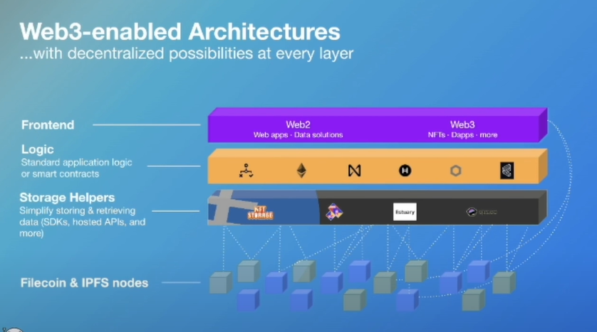

## Filecoin Overview
Filecoin is storage designed for Web3 from the ground up

### 100% verifiably stored with trackable cryptographic proofs
Proof of replication: // bằng chứng sao chép
Ensures that providers are actually storing data and keeping it safe

Proof of spacetime: // bằng chứng không-thời gian
Uses  block rewards as incentives and collateral slashing as penalties
// 

### Permanence Control - Your data, Your choice!
Market Deals:
Gives you control over the permanence & resilience of your data

### Fleek hosting
Designed for
- Fast, modern, censorship-proof websites and web-apps on the open web
- Works with most modern frameworks (Docker, Gatsby, React, Webflow, Hugo, Next, Jekyll, etc.)

**How it works**
- Connect your Github repository
- Add build settings
- Deploy your site to IPFS
- Backed up to Filecoin

Usage
- Github Actions
- CLI
- GraphQL API

### NFT.Storage
Designed for
- NFT devs who want free, multi-generational, decentralized storage

**How it works**
- Compute CID of data locally that can be used in an NFT as a pointer to your content
- Once data is uploaded, available to retrieve via IPFS and backed up to Filecoin (>8x redundancy)
- Long-term decentralization in the works (smart contract-enforced redundancy, DAO-based funding)
- Store everywhere else that makes you comfortable

Usage
- Javascript client library
- HTTP API + remote pinning service
- Web interface

### Web3.Storage
Designed for
- General Filecoin & IPFS storage
- Familiar and simple interfaces
- Production-level storage and retrieval reliability + performance

How it works
- Compute CID of data locally and upload to edge worker
- Data immediately available to the IPFS network
- Automatically stores with 6+ Filecoin providers around the world
- 1 TiB always free

Usage
- Javscript and Go client libraries
- HTTP API + remote pinning service
- Web interface

# Web3-enabled Architectures (with decentralized possibilities at every layer)

Recap:
Ethereum, Polygon or Avalanche, etc không phải nơi nên lưu trữ data, vì nó quá đắt đỏ. Các smart contract platforms này không phải layer có nhiệm vụ lưu trữ data, mà chúng là logic layers, decentralized smart contract, decentralized logic. Vậy khi có 1 đống dữ liệu, lựa chọn sẽ là IPFS and Filecoin.